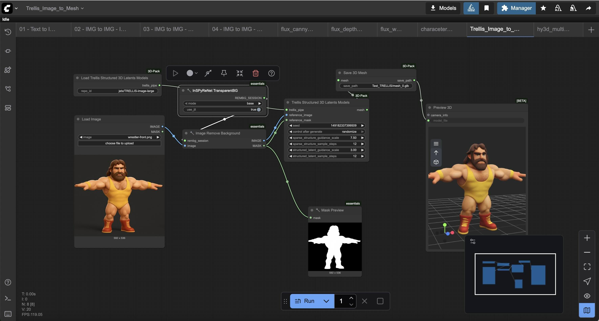

# Comfy3D

**Comfy3D** is a GPU-accelerated containerized environment for advanced 3D workflows using [ComfyUI](https://github.com/comfyanonymous/ComfyUI), enhanced with real-time diffusion models like Hunyuan3D, FLUX, and various 3D/ControlNet extensions. 

This setup provides out-of-the-box workflows for image generation, video generation, textured meshes, and multi-view renders, all within a reproducible and customizable Docker environment. 

Docker containers are deployed to [https://hub.docker.com/r/michaelgold/comfy3d](https://hub.docker.com/r/michaelgold/comfy3d)




---

## Running

You can easily spin up instances of this Docker container on Runpod

<a href="https://console.runpod.io/deploy?template=j75puttb7q&ref=74ihrngg" target="_blank" rel="noopener">
  
</a>

<a href="https://console.runpod.io/deploy?template=0qedwpn0gt&ref=74ihrngg" target="_blank" rel="noopener">
  
</a>

---

## ✨ Features

- 📦 **Prebuilt Docker Environment** with CUDA 12.1 and 12.6 support
- 🧱 **Custom Nodes**:
  - [ComfyUI-Manager](https://github.com/ltdrdata/ComfyUI-Manager)
  - [Hunyuan3D Wrapper](https://github.com/kijai/ComfyUI-Hunyuan3DWrapper)
  - [ComfyUI-3D-Pack](https://github.com/MrForExample/ComfyUI-3D-Pack)
  - [ControlNet Extensions](https://github.com/cubiq/ComfyUI_essentials)
- 🧠 **Included Models**:
  - Tencent's `Hunyuan3D-2` (`hy3dgen`)
  - Flux Dev and Flux Kontext
  - Wan 2.2 (Video)
  - QWEN Image and QWEN Image Edit
  - Comfy 3D Pack 
- 🧪 Ready-to-use **workflows** for:
  - Character generation (`characeter_flux.json`)
  - 3D mesh reconstruction (`hy3d.json`)
  - Multi-view + texture baking (`hy3d_multiview.json`)

---

## 🐳 Getting Started

### Prerequisites

- Docker with NVIDIA GPU support
- NVIDIA GPU with CUDA >= 12.1
- (Optional) VS Code with Dev Containers support

---

### 🏗️ Build & Run Locally

#### Development (hot-reload, volumes mapped):

```bash
docker compose -f docker-compose.dev.yml up --build
```

#### NVIDIA DGX Spark / Linux ARM64:

The published `michaelgold/comfy3d:latest` image is currently AMD64-only. On a
DGX Spark (GB10), build and run the native ARM64 image instead:

```bash
docker compose -f docker-compose.arm64.yml up --build
```

This uses `Docker/Dockerfile.arm64`, CUDA 13, ARM64 PyTorch wheels, and native
SM 12.0 code (binary-compatible with the GB10's SM 12.1). PyPI does not publish
`onnxruntime-gpu` for Linux ARM64, so this target uses CPU ONNX Runtime for
ONNX-backed nodes. Blender-backed nodes use the validated native
`bpy 5.2.1` CPython 3.13 ARM64 wheel from buildbpy's checksummed,
versioned GitHub Release.
Open3D remains preloaded in the ComfyUI process for ARM64 static-TLS
compatibility, while Blender work runs in isolated subprocesses without that
preload to avoid Open3D/Blender TBB ABI conflicts.

The app runs at http://localhost:8188

#### Production (published AMD64 image):

```bash
docker compose up -d
```
The app runs at http://localhost:8188

#### 🧬 Structure
```pre
├── Docker/                   # Dockerfile and build logic
├── .devcontainer/            # VS Code container dev config
├── workflows/                # JSON workflows for ComfyUI
├── input/                    # Sample input images
├── output/                   # Output directory (mounted)
├── utils/
│   └── init.sh               # Container entrypoint
├── docker-compose.yml        # Production stack
├── docker-compose.dev.yml    # Development stack
└── docker-compose.studio.yml # Studio workstation stack
```

#### 🧠 Models
The following models can be downloaded at runtime with the included [ComfyUI-HF-Model-Downloader](https://github.com/michaelgold/ComfyUI-HF-Model-Downloader) addon:

- Hunyuan3D-2 Turbo: tencent/Hunyuan3D-2
- ControlNet/FLUX Models (via mounted models/ folder)

####  🧪 Sample Workflows
1. Character Sheet (Flux)
workflows/characeter_flux.json

Generates a 1980s video game-style wrestler character from a single image and prompt using FLUX guidance.

2. Single-view Mesh (hy3d.json)
From 1 image (e.g., wrestler-front.png), generates a textured GLB mesh and multiview renders.

3. Multi-view Mesh (hy3d_multiview.json)
From 4 directional views, generates consistent textured 3D mesh with advanced postprocessing and export.

#### 🛠️ VS Code Dev Container
If using VS Code:

Open in container (Dev Containers extension)

Auto-runs utils/init.sh

Installs ComfyUI, custom nodes, and all Python deps in a virtualenv

#### 📤 Output
All images and GLB files are saved to the output/ directory, which is volume-mounted and shared across builds.

#### 📜 License
MIT License. Third-party model licenses may apply.

####  📬 Contact
Maintained by [@michaelgold](https://x.com/michaelgold)
For issues or ideas, please [open an Issue](https://github.com/michaelgold/comfy3d/issues/new).
